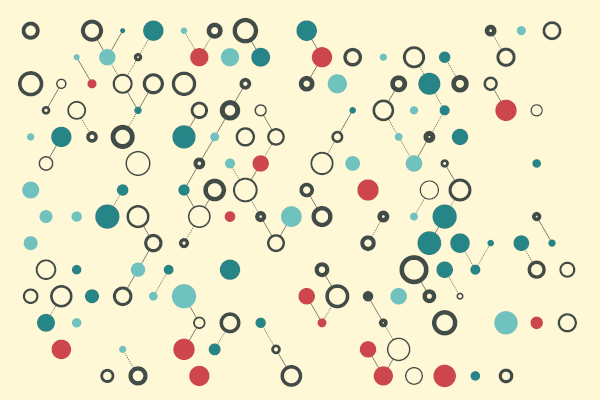

## Kristin J. Lennert (@kristinjeanna)

  

### About me

Hey! I'm Kristin. I work at a Chicago-area university as a Java developer and an integration engineer. My work development is mostly Java but most of my recent personal projects are in Go (golang).

I started my work life as a high school science teacher (eons ago) but have been in the IT field now for about 23 years in a variety of roles: user support, system administration, information security, and software engineering, with the bulk of my experience in the latter two.

### Interests

- Go
- DevOps & automation
- Code quality
- Glitch art, generative art, and creative coding
- Home automation
- Photography

